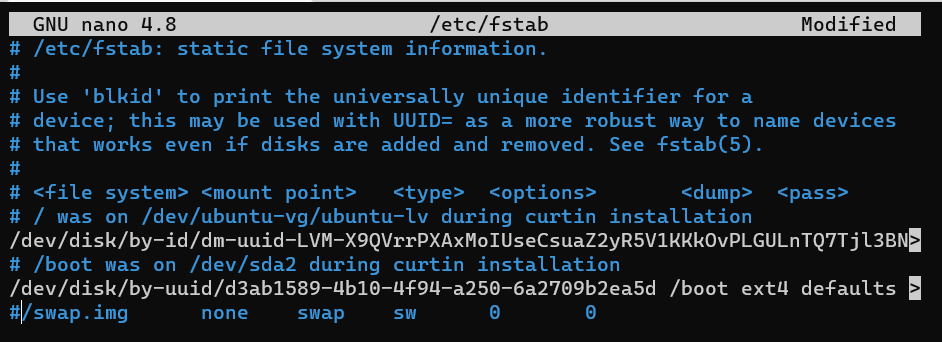
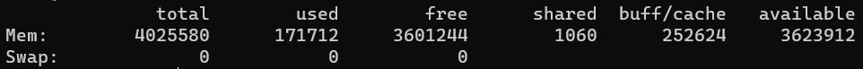
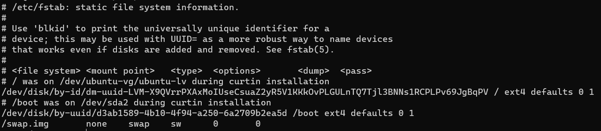

# K8S

### Kube Architecture
- Control Plane 
  - API Server
    - access and manage cluster (สำหรับเข้าถึงและจัดการ cluster)

  - Controller Manager
    - control node in cluster (ควบคุม node ภายใน cluster)
  
  - Scheduler 
    - assign task to node (กระจายงาน)

  - Cluster DNS
    - manage object to communicate by Protocal Network (จัดการ object หรือ componant ที่ต้องสื่อสาร หรือต้องติดต่อกันผ่านทาง Protocal network ด้วย DNS)

  - ETCD
    - Insert information of Object, such Ip address (จัดเก็บข้อมูลของ object เช่น Ip address)

- Worker node
  - Kubelet
    - contact by API (ติดต่อด้วย API)
    - receive command from user control pane, such resouce of container (รับคำสั่งจากผู้ใช้งานเพื่อนำคำสั่งไปจัดการสร้าง container เช่น การจอง resouce)

  - Kubeproxy
    - connect to container or pods by network(สำหรับเชื่อมต่อ pod หรือ container ผ่าน network)

## K8S Remote
### SSH
  - Remote to machine for create component kube
  - Requirements
    - Linux VM [setup VM](#setup-linux-vm)
      - Container runtime, such Docker or CRIO
      - 2 CPU
      - 2 GB RAM
      - conntrack
    - Windown [setup windown](#setup-windown)
    1. Check and delete or backup path .kube and .minikube on path user or root
    2. Create cluster `don't connect ssh`
       ```
       minikube start --driver=ssh --native-ssh=false --ssh-ip-address=[IP HOST] --alsologtostderr -v=4
       ```

  - Ref
    - https://minikube.sigs.k8s.io/docs/drivers/ssh/

### Setup Linux VM
  - Swap turn off
    ```
    swapoff -a
    nano /etc/fstab #comment swap
    ```
    

    - <details>
      <summary>verify swap turn off</summary>

      ```
      free
      ```
      

      ```
      more /etc/fstab
      ```
      

      </details>

  - Install docker
    ```
    curl -fsSL https://get.docker.com -o get-docker.sh
    sudo sh get-docker.sh
    ```

  - Install socat and conntrack
    ```
    sodu apt install socat conntrack
    ```
  
  - Restart Host docker
    ```
    sudo init 6
    ```

### Setup windown
 - <details>
   <summary>Create Key on machine</summary>

   - open powershell on Administrator
   - Create ssh key
   ```
   ssh-keygen.exe -b 4096 #4096 size key
   ```

   - open file ssh and copy or export key
   ```
   more .\.ssh\id_rsa.pub
   ```

   </details>

 - <details>
   <summary>Create Key on Github</summary>

   

   </details>

### Setup ssh key on Linux
 - <details>
   <summary>Machine</summary>

   - open on Administrator
   ```
   sudo -i
   ```

   - paste or import ssh-key in file authorized_keys
   ```
   nano .ssh/authorized_keys
   ```

   </details>

 - <details>
   <summary>Github</summary>

   

   </details>

### tool on Linux
  - btop
    - check process run on linux
    - install 
      ```
      sudo snap install btop
      ```

### tool on Windown
 - Bitvise

### Ref
- https://www.youtube.com/watch?v=QJ9rM4VFK_4